# Лабораторно-практична робота №3

## Короткий опис призначення API

### Створення захищеного REST API з базовою аутентифікацією через заголовки X-Login та X-Password. API містить два основні ресурси - documents та employees, доступ до яких залежить від ролі користувача (user або admin).

## Інструкції з встановлення залежностей та запуску: npm install, npm start.

### npm install -> встановити залежності

### npm start -> запустити сервер

## Інструкції з запуску тестового клієнта: npm test.

### npm test -> запуск тестового клієнта

## Таблиця з описом всіх реалізованих ендпоінтів

|  Метод  |      URL      |                Опис                      |      Заголовки    |               Тіло запиту                |                                     Коди відповіді                                |
|---------|---------------|------------------------------------------|-------------------|------------------------------------------|-----------------------------------------------------------------------------------|
|   GET   | /documents    | Отримати список документів               |X-Login, X-Password|-                                         |200 - OK, 401 - без аутентифікації                                                 |
|   GET   | /employees    |Отримати список працівників (тільки admin)|X-Login, X-Password|-                                         |200 - OK, 403 - доступ заборонено, 401 - без аутентифікації                        |
|   GET   | /non-existent |Тест маршруту, якого не існує             |-                  |-                                         |404 - не знайдено                                                                  |
|   POST  | /documents    |Створити новий документ                   |X-Login, X-Password|{ "title": "string", "content": "string" }|201 - створено, 400 - помилка валідації, 401 - без аутентифікації                  |
|  DELETE | /documents/:id|Видалити документ (тільки admin)          |X-Login, X-Password|-                                         |204 - успішно, 404 - не знайдено, 403 - доступ заборонено, 401 - без аутентифікації|

## Перевірка роботи ендпоінтів за допомогою Postman

### GET http://localhost:3000/documents

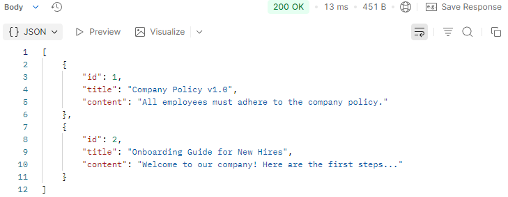

### GET http://localhost:3000/employees

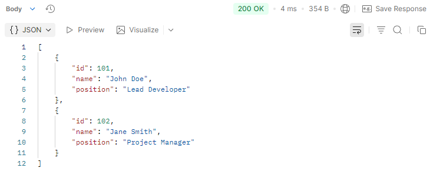

### POST http://localhost:3000/documents

### Перевірка

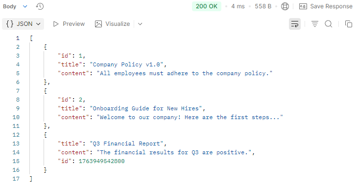

## Тестування захищених ендпоінтів

### Сценарій 1 (Немає доступу)

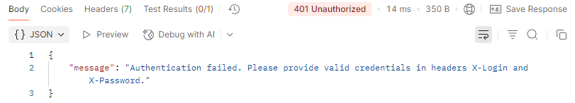

### Сценарій 2 (Доступ для user):

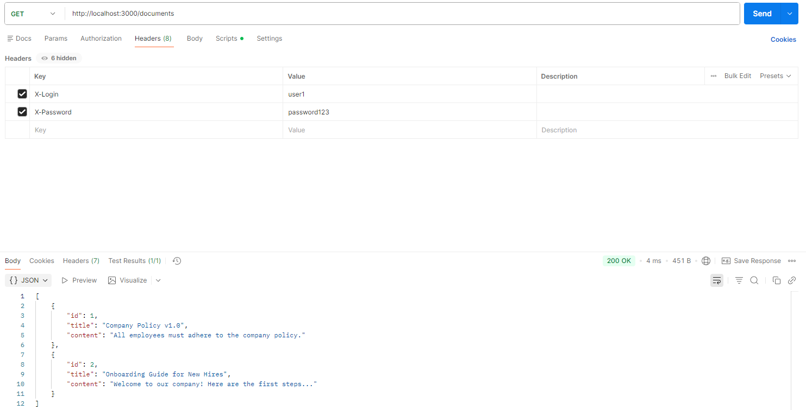

### Сценарій 3 (Заборона доступу для user):

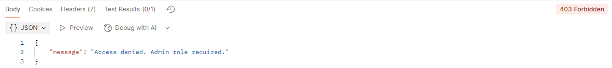

### Сценарій 4 (Доступ для admin):

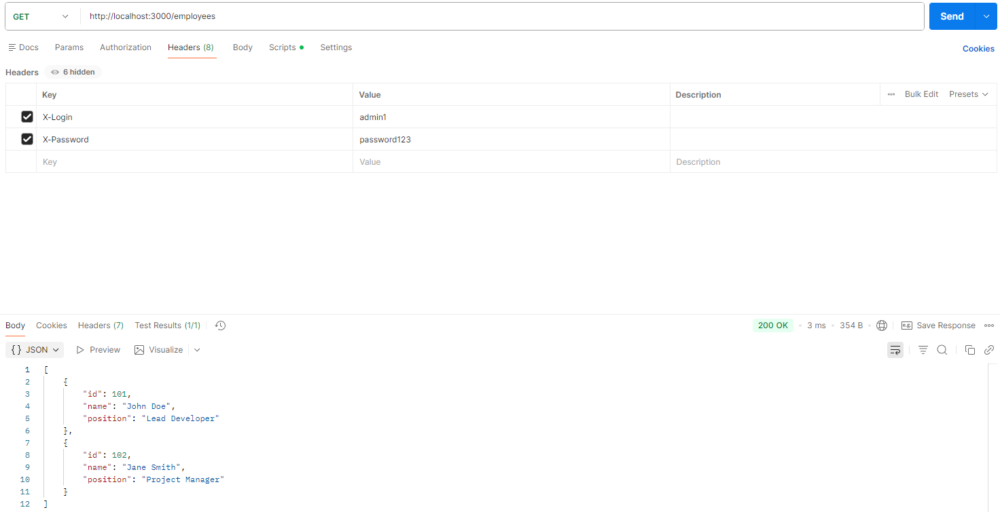

## Тестування за допомогою Postman

### Метод: GET , URL: /documents , Заголовки (Headers): - , Тіло (Body): - , Очікуваний статус: 401 Unauthorized , Примітка: Спроба доступу без аутентифікації.

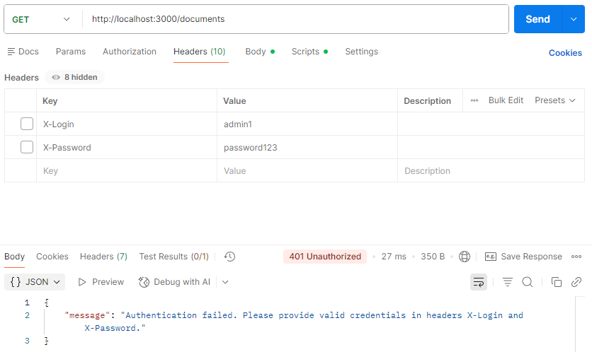

### Метод: GET , URL: /employees , Заголовки (Headers): X-Login: user1, X-Password: password123, Тіло (Body): - , Очікуваний статус: 403 Forbidden , Примітка: Спроба доступу до адмін-ресурсу з роллю 'user'.

### Метод: GET , URL: /documents , Заголовки (Headers): X-Login: user1, X-Password: password123, Тіло (Body): - , Очікуваний статус: 200 OK , Примітка: Успішне отримання даних з роллю 'user'.

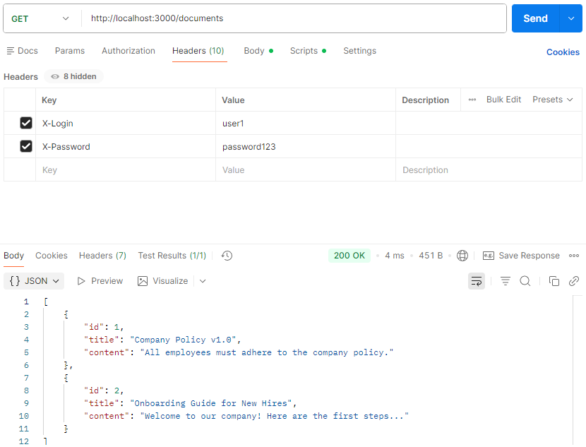

### Метод: GET , URL: /employees , Заголовки (Headers): X-Login: admin1, X-Password: password123, Тіло (Body): - , Очікуваний статус: 200 OK , Примітка: Успішне отримання даних з роллю 'admin'.

### Метод: POST , URL: /documents , Заголовки (Headers): X-Login: user1, X-Password: password123, Тіло (Body): { "title": "Test Doc", "content": "..." } , Очікуваний статус: 201 Created , Примітка: Успішне створення ресурсу.

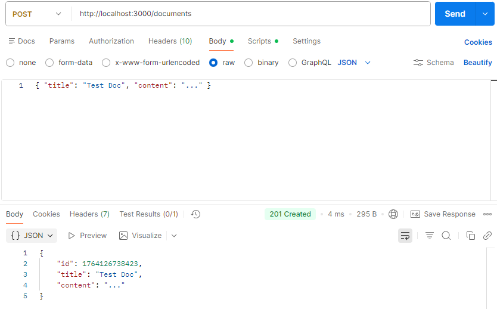

### Метод: POST , URL: /documents , Заголовки (Headers): X-Login: user1, X-Password: password123, Тіло (Body): { "content": "..." } , Очікуваний статус: 400 Bad Request , Примітка: Помилка валідації (відсутнє поле title).

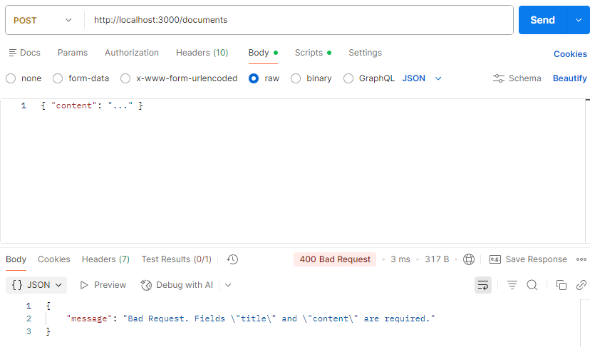

### Метод: Delete , URL: /documents/1 , Заголовки (Headers): X-Login: admin1, X-Password: password123, Тіло (Body): - , Очікуваний статус: 204 No Content , Примітка: Успішне видалення. Відповідь не має тіла.

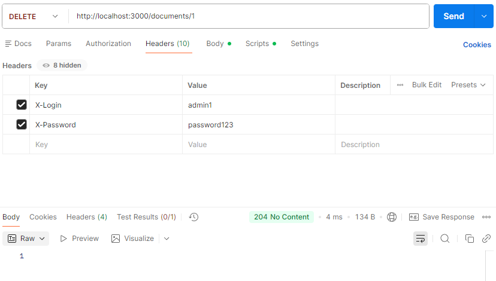

### Метод: GET , URL: /non-existent , Заголовки (Headers): X-Login: admin1, X-Password: password123, Тіло (Body): - , Очікуваний статус: 404 Not Found , Примітка: Звернення до неіснуючого маршруту.

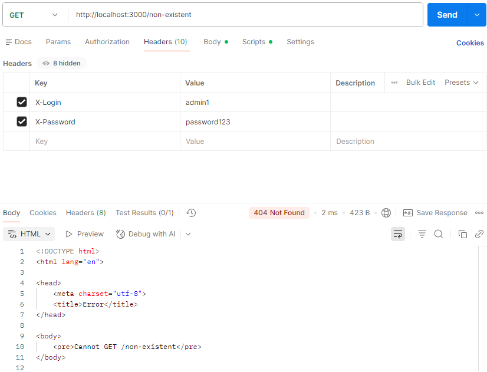

## Тестування за допомогою Node.js скрипта

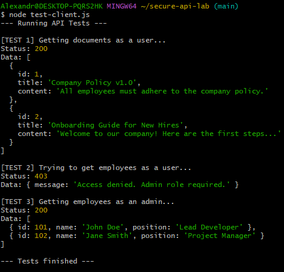
